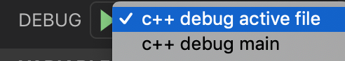

# C++ Starter Project for CSE100

This is a C++ starter project for CSE100.

ℹ️ Before continuing, make sure you have either opened the project in a devcontainer, or on ieng6, or have all required tools installed on your machine. Check the [SETUP.md](SETUP.md) document if you are unsure about which tools you need.

ℹ️ The commands you can run in this project are listed in [COMMANDS_CHEATSHEET.md](COMMANDS_CHEATSHEET.md)

## Building (Compiling And Running Executables)

- This project uses the `CMake` build configuration system which will automatically generate `Makefiles`. You can find more information on `CMake` here: https://cmake.org/ and here: https://cliutils.gitlab.io/modern-cmake/. 
- To initialize the build setup using CMake, first create a build directory `mkdir build` and cd into it `cd build`. Then run `cmake ..` to generate the Makefiles.  
⚠️NOTE: Only run the `cmake ..` command from inside your build directory. Do not try to run `cmake .` in your project root, because this will clutter your project with autogenerated build files.
- You can now build all executables of your project by running `make` inside your build directory.
- To compile a single executable after build setup, type: `make name-of-the-executable` as it appears in the `Makefile`.
- All the src executables are under `./build/src/`.
- All the test executables are under `./build/test/`.
- (Take a look at the `CMakeLists.txt` files in the project root, src and test directories to understand how the build process works.)

## Testing

To run your tests you first have to build your project. See the section above on how to do that.
If you have compiled your project, you can run all the tests by running `make test` from within the build directory.

You can run a single test like so: `./build/test/path/file-name`

### GoogleTest

The GoogleTest framework allows you write unit tests for your code. Test files are under the `test/` directory in this project. To write a test, use the `TEST` macro:

```cpp
TEST(SuiteName, TestName) {
    // Test code goes here
}
```

The GoogleTest framework uses assertions to determine whether a test has passed or failed. For instance, here are some of the assertions available:

- `ASSERT_EQ(val1, val2)` - Fails the test if the two values are not the same (note: this uses the `==` operator, so for pointers, it looks for pointer equality instead of equality between the two underlying objects).
- `ASSERT_NE(val1, val2)` - Fails the test if the two values are the same.
- `ASSERT_GT(val1, val2)` - Fails the test if `val1 <= val2`.
- `ASSERT_GE(val1, val2)` - Fails the test if `val1 < val2`
- `ASSERT_LT(val1, val2)` - Fails the test if `val1 >= val2`
- `ASSERT_LE(val1, val2)` - Fails the test if `val1 > val2`

You can learn more about writing tests from the [GoogleTest documentation](https://github.com/google/googletest/blob/master/googletest/docs/primer.md).

If you want to add a new C++ file with tests, you will also have to update the corresponding `CMakeLists.txt` file in order to compile the test file.

### Code Coverage

Calculating code coverage is a way of measuring the quality of your test suite. 
A code coverage report shows the lines of code that were executed by your tests. 
This will give you insight into the weaknesses in your test suite as you can easily see which lines of code are not yet tested.

You can generate a code coverage report of your tests by running:
`make cov` from within the `build` directory.
The coverage report should appear under `build/code_coverage`. You can open `index.html` in your browser to see the full report.

If you are ssh'd into ieng6, you will need to download the coverage report to your computer first before you can open it in a browser.

## Tools for Code Quality

This project includes numerous tools that can help you make sure that the quality of your code is on par.

### Auto Formatting

If you're working in a devcontainer, you may already have noticed that the code gets autoformatted when you save. This project is using `clang-format` to achieve that.
On ieng6, you'll have to run `clang-format` yourself.

To run `clang-format` on the entire project run:
`make format` from within the `build` directory.

### Static Analysis

Static analysis tools parse your source code for possible causes of bugs and violations of code style rules.
They will notify you of suspicious looking code that may have a bug in it.

This project supports the following static analyzers:

- `make cppcheck`
- `make scan-build`

### Dynamic Analysis

Dynamic analysis tools do not parse the source code, but execute the compiled files. This project supports `Valgrind`.

- `valgrind build/path/to/the/executable_file`

## Debugging

Both the devcontainer and ieng6 come with gdb installed and by default all source files are compiled with debugging support enabled. 

You can run gdb like this: `gdb build/path/to/the/executable_file`

Try debugging main and then try debugging a test.

### Debugging in the devcontainer

In the devcontainer we've also included 2 debugging tasks in the VSCode setup.
Click the debug window icon on the left or use the short cut ctrl+shift+d (cmd+shift+d on mac).
You can see the following debug tasks:


You can run the debug task by clicking the green play icon.

Alternatively, you can press F5 to run the currently selected debug task.

⚠️NOTE: The "debug active file" task will not work if your active file cannot be compiled to an executable. In case of an error look at the corresponding `CMakeLists.txt` to make sure that the file you are trying to debug is being compiled into an executable.

You can create breakpoints by clicking left of the line numbers in VSCode.
