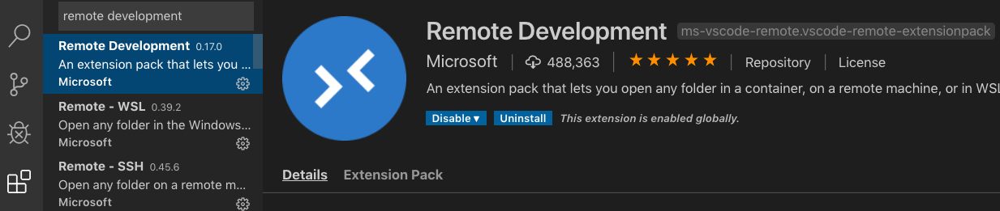
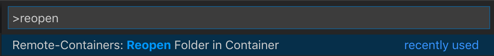

# Project setup

There are three ways of working on the PAs for this class: 

1. Use the ieng6 lab machines. 
2. Use a devcontainer on your own computer.
3. Configure a programming environment by yourself.

## Getting Started with ieng6

If you don’t want to setup a devcontainer on your machine, you have the option to remotely connect to the lab machines (a.k.a. ieng6) using ssh or physically work in the lab. No additional setup is necessary for you to do, as the lab computers are already equipped with all the tools that you need to work on your PA. Here’s a step by step guide for you to get started:

**1. Connect to ieng6** (skip this step if you are physically working on a lab machine)
If you’re on a Mac, you can open a terminal and use the command below and enter your password when prompted to connect to ieng6:

`ssh <your_cse_100_account>@ieng6.ucsd.edu`

For windows users, we encourage you to use the super convenient tool MobaXterm.

**2. Get the starter code**
This step is given to you on the write-up, but in summary, you have to clone the starter code repository by running the command below and enter your github username and password when prompted:

`git clone <the-url-provided-in-the-writeup>`

Everything from this point on is the same as what you would do if you were working in a devcontainer, but here’s a concise guide to compiling and running your code. 

**3. Compiling your code**
Before trying to compile on ieng6, run the following command to activate a newer compiler:

`source scl_source enable devtoolset-7 llvm-toolset-7`

Go into the root directory of your project:

`cd <name-of-the-project-directory>`

To compile your code run

```bash
mkdir build
cd build
cmake ..
make
```

**4. Running executables**
The `build` directory contains the compiled binary executables that you can run.

**5. Running unit tests**
To run your unit tests, in your project root directory, run

```bash
make
make test
```

**6. Downloading the code coverage report**
To download the code coverage report from ieng6, you can use `rsync`, `rcp` or `git`. If you want to use git to download your coverage report, you'll have to edit the first line of the `.gitignore` file in your project like so:

```bash
build/*
!build/code_coverage/
```

More information about testing is provided in the README.

## Getting Started with the Devcontainer

- ⚠️NOTE: Windows users, when installing Docker it may ask you if you want to configure it for running Windows containers or Linux containers. Choose Linux containers.
- ⚠️NOTE: Windows users, if you are running Windows Home edition, first read the note below the next item!
- Download and install Docker Desktop: https://www.docker.com/products/docker-desktop
  - ⚠️NOTE: Docker Desktop for Windows requires the Hyper-V Windows feature which is not available on Home-edition. If you are running Windows Home-edition, either upgrade to Windows Education-edition or install Docker Toolbox instead: https://docs.docker.com/toolbox/toolbox_install_windows/
- Make sure docker is running
- Download and install VSCode
- Open VSCode, click the "Extensions" icon on the left and install the "Remote Development" extension by Microsoft
 
- Open this project in VSCode
- There will be a popup asking if you want to open it in a devcontainer:

- Click "Reopen in Container"
- If you don't see the popup, you can also open the devcontainer with a command. 
  - open the Command Palette in VSCode: `ctrl+shift+p` (`cmd+shift+p on mac`)
  - type "reopen" and hit enter
  
- The first time you are opening the devcontainer it will take a couple of minutes to install. But if you reopen it again at a later moment it should only take a matter of seconds.
- Once the devcontainer is up and running you'll see the files in your project reappear on the left
- Open bash in the VSCode Terminal tab:

  - ℹ️If you don't see a TERMINAL tab in the bottom panel of your screen, hit ``ctrl+` ``
  - ℹ️If you don't see a "Bash" option in the dropdown, click the plus icon to the right of the dropdown
- Cool, now you are fully set up to begin developing on the project!

## Configuring a programming environment by yourself

Take a look at the `.devcontainer/raw.Dockerfile` to see what programs you may need to install. Here is a summary of the required programs:

- g++
- make
- cmake
- python
- lxml (can be installed through pip, for generating the coverage report)
- lcov (with an L not I, for generating the coverage report)
- clang-format (for the auto formatter)

Having the following tools will be handy as well:

- gdb (for debugging)
- valgrind (for memory leak analysis)
- cppcheck (static code analysis, helps identify possible bugs)
- scan-build (static code analysis, helps identify possible bugs)
